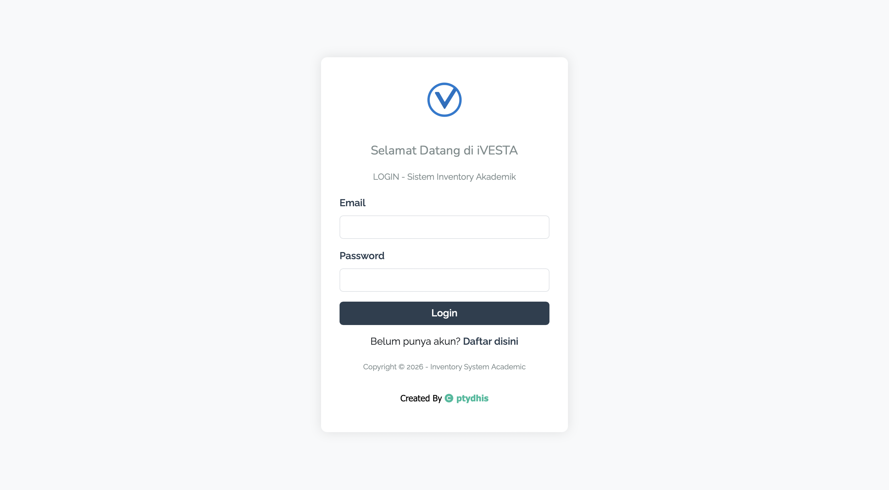
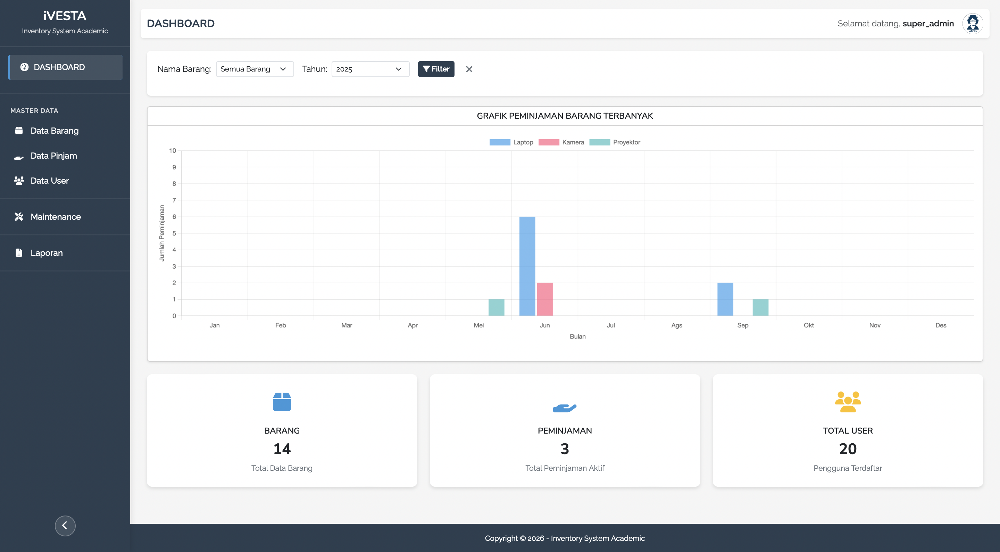
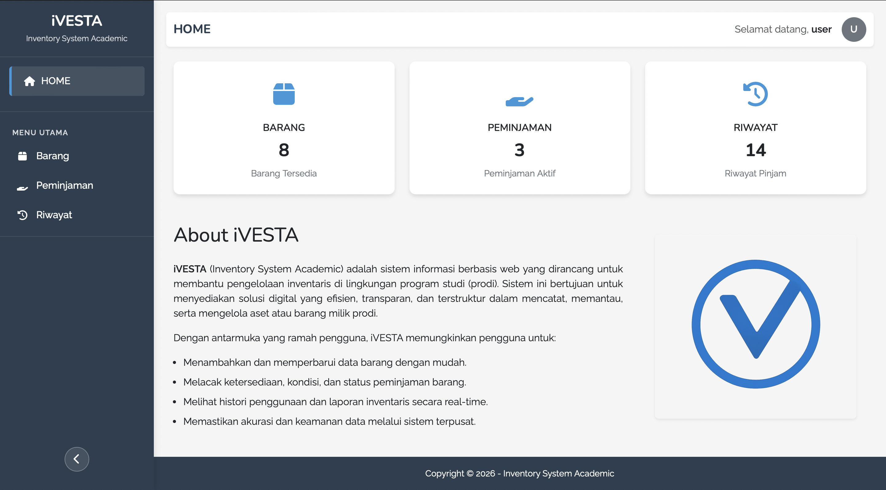
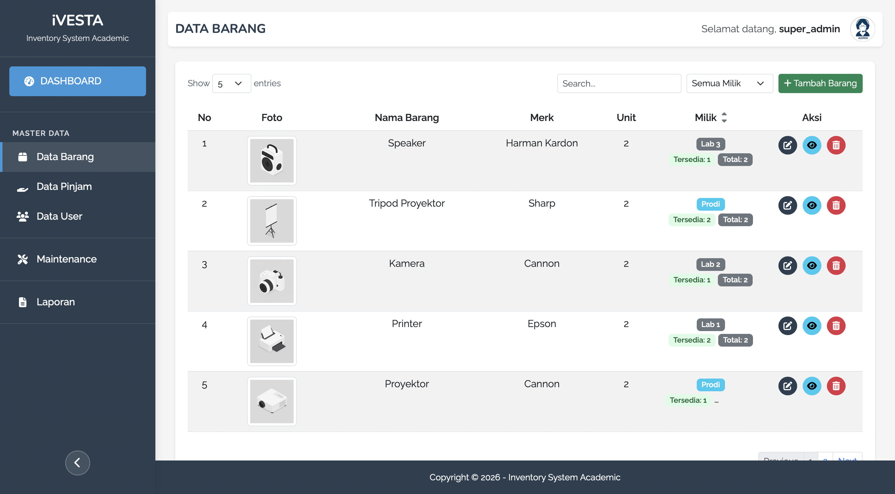
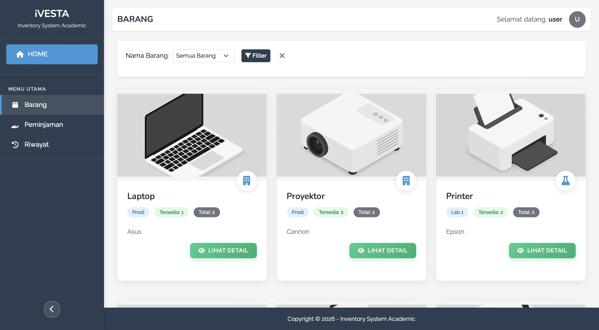
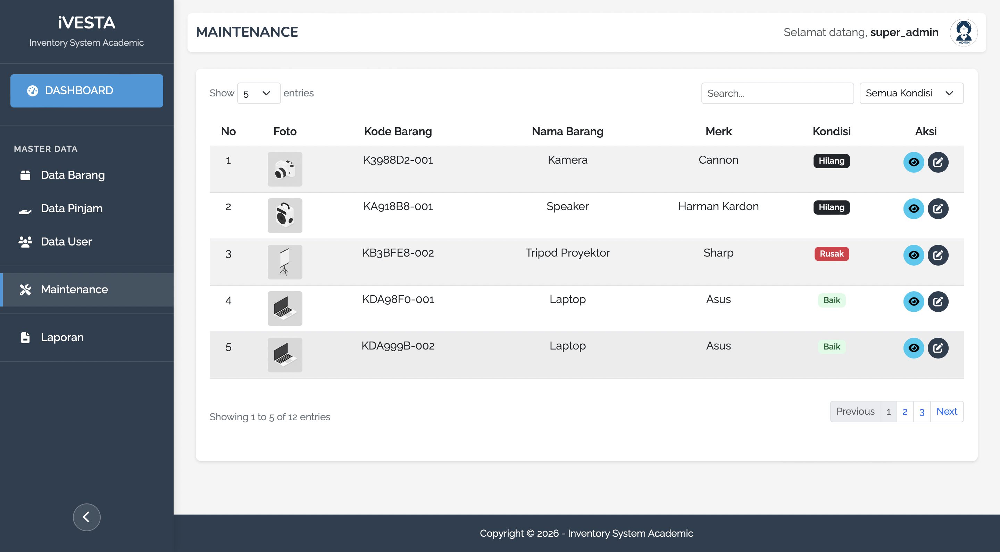
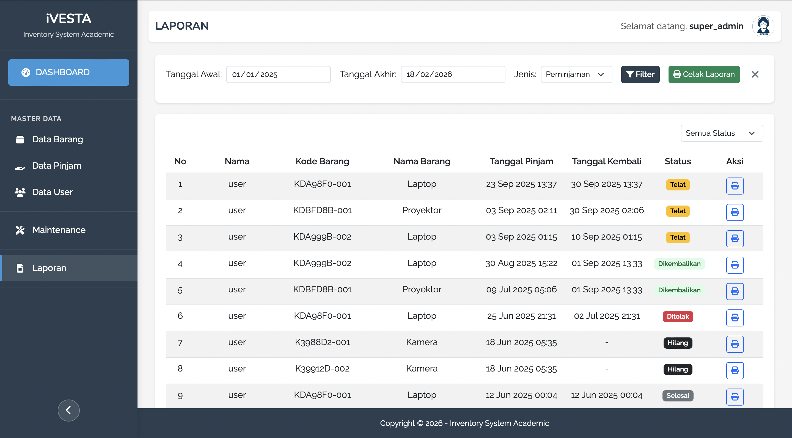

# iVESTA - Sistem Informasi Inventaris Barang

iVESTA adalah sistem inventaris barang berbasis web yang dikembangkan menggunakan PHP Native dan MySQL. Sistem ini dirancang untuk membantu pengelolaan data inventaris secara terstruktur, efisien, dan terdokumentasi dengan baik.

## Main Features

- 🔐 Login Admin
- 📦 Manajemen Data Barang (CRUD)
- 🗂 Manajemen Kategori
- 📥 Stok Masuk
- 📤 Stok Keluar
- 📊 Laporan Inventaris
- 🧾 Sistem Riwayat Transaksi

## Screenshots

### Login

### Dashboard

### Barang

### Maintenance

### Laporan

## Kredensial Login

| email | password | role |
  |---|---|---|
  | admin@gmail.com | 123456 | admin |
  | user@gmail.com | 123456 | user |
  | kaprodi@gmail.com | 123456 | kaprodi |

## License

Project ini dibuat untuk keperluan pembelajaran dan pengembangan sistem inventaris internal.

